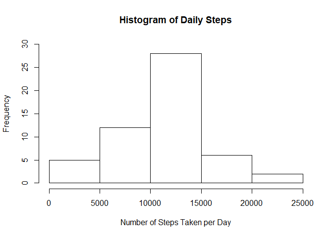
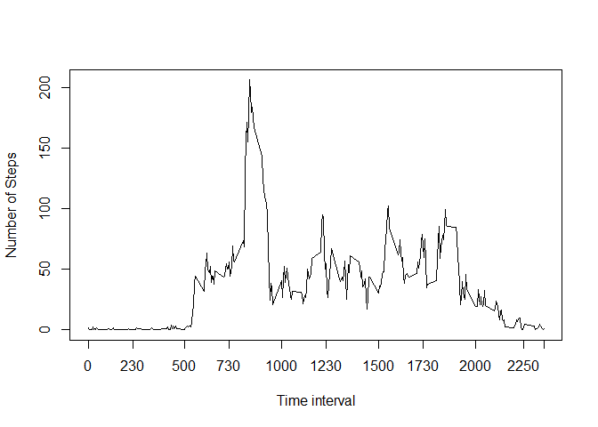
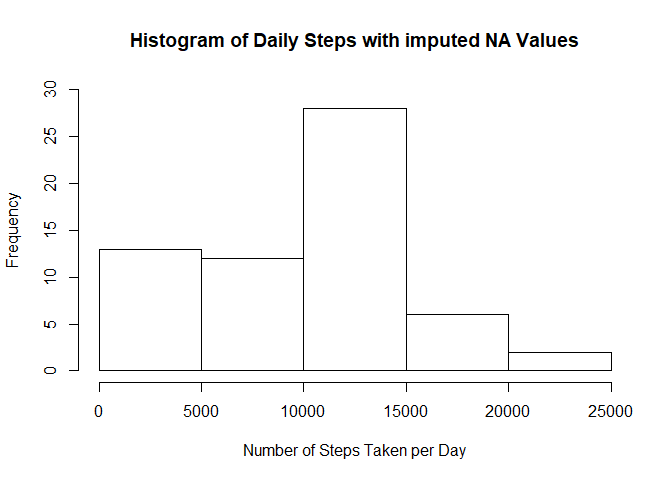
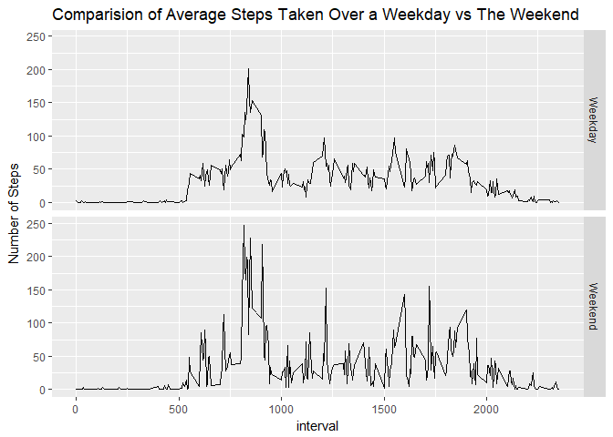

## Loading and preprocessing the data
After downloading the files from [Link](https://d396qusza40orc.cloudfront.net/repdata%2Fdata%2Factivity.zip) and unzipping them into the working directory the following code was used to read the data in RStudio.


```r
library(tidyverse)
```

```
## Loading tidyverse: ggplot2
## Loading tidyverse: tibble
## Loading tidyverse: tidyr
## Loading tidyverse: readr
## Loading tidyverse: purrr
## Loading tidyverse: dplyr
```

```
## Conflicts with tidy packages ----------------------------------------------
```

```
## filter(): dplyr, stats
## lag():    dplyr, stats
```

```r
activity_data <- as.tibble(read_csv("./activity/activity.csv", col_names = T))
```

```
## Parsed with column specification:
## cols(
##   steps = col_integer(),
##   date = col_date(format = ""),
##   interval = col_integer()
## )
```

## What is mean total number of steps taken per day?
To answer this question the data was summarized by date and the total steps calculated per day as below creating the following histogram.


```r
steps_daily <- activity_data %>% group_by(date) %>% summarise(total_steps = sum(steps))
hist(steps_daily$total_steps, ylim = c(0,30), xlab = "Number of Steps Taken per Day", main = "Histogram of Daily Steps")
```

<!-- -->

```r
##Calculating Mean and Median
mean1 <- round(mean(steps_daily$total_steps, na.rm = T), digits = 0)
median1 <- median(steps_daily$total_steps, na.rm = T)
```

The mean total number of steps taken per day is 1.0766\times 10^{4} and the median is 10765. Note for the purpose of these calculationg the NA values were ignored per assignment.


## What is the average daily activity pattern?
To answer this question the following code was used to remove NAs, group the data according to interval, and then, summarized to reflect the average steps taken during that interval. Finally, a line-plot was created to visualize the same, along with, a calculation of which interval had the most average steps.


```r
##removing NAs
activity_data_no_na <- na.omit(activity_data)
##Creating an average daily pattern.
daily_pattern <- group_by(activity_data_no_na, interval) %>% summarise(ave_steps = mean(steps))
##Plotting the average daily pattern
plot(daily_pattern$interval, daily_pattern$ave_steps, type = 'l', axes = F, ylab = "Number of Steps", xlab = "Time interval")
axis(side = 1, at = c(0,230,500,730,1000,1230,1500,1730,2000,2250, 2355))
axis(side = 2, at = c(0,50,100,150,200,250))
box()
```

<!-- -->

```r
##Which interval has the most number of average steps
max_interval <- daily_pattern %>% filter(ave_steps == max(ave_steps))
message("The interval with the maximum average steps is ", max_interval$interval)
```

```
## The interval with the maximum average steps is 835
```

## Imputing missing values

The following code was run to ascertain where the missing NAs were located.


```r
sum(is.na(activity_data$steps))
```

```
## [1] 2304
```

```r
sum(is.na(activity_data$date))
```

```
## [1] 0
```

```r
sum(is.na(activity_data$interval))
```

```
## [1] 0
```

As can be seen the missing values are all in the $steps column. It was decided to use median of the number of steps taken to avoid influencing the data as much as possible with the large spikes noted in the line-plot. That was done by the following code.The new data set was then summarized to provide the new average daily steps, along with the mean and median of the same.


```r
new_activity_data <- activity_data %>% transform(steps = ifelse(is.na(steps), median(steps, na.rm = TRUE), steps))
##New Daily Steps
steps_daily_new <- new_activity_data %>% group_by(date) %>% summarise(steps = sum(steps))
##New Mean
mean2 <- round(mean(steps_daily_new$steps))
##New Median
median2 <- median(steps_daily_new$steps)
```

Comparing the two means 1.0766\times 10^{4} vs `rmean2` and the two medians 10765 vs 1.0395\times 10^{4} one notices that the mean and median have fallen somewhat. A quick check on comparing the substitions of the NA values gives us a clue why.


```r
head(activity_data)
```

```
## # A tibble: 6 x 3
##   steps       date interval
##   <int>     <date>    <int>
## 1    NA 2012-10-01        0
## 2    NA 2012-10-01        5
## 3    NA 2012-10-01       10
## 4    NA 2012-10-01       15
## 5    NA 2012-10-01       20
## 6    NA 2012-10-01       25
```

```r
head(new_activity_data)
```

```
##   steps       date interval
## 1     0 2012-10-01        0
## 2     0 2012-10-01        5
## 3     0 2012-10-01       10
## 4     0 2012-10-01       15
## 5     0 2012-10-01       20
## 6     0 2012-10-01       25
```

We see that the NA values have been replaced by '0' - the median - and so the drop in mean and median makes sense because the previous calculations ignored the NA values while the new calculations increase the number of observations but do not had to the total of the step counts. This can be further visualized by plotting a histogram of the data.


```r
hist(steps_daily_new$steps, ylim = c(0,30), xlab = "Number of Steps Taken per Day", main = "Histogram of Daily Steps with imputed NA Values")
```

<!-- -->

One can see the increase in frequency of the 0-5000 'bucket'. It seems like there is ~ 8 days of new data in that bucket. Again, this makes sense because the 2304 intervals of missing data is about 8 days worth (2304/288 = 8).

## Are there differences in activity patterns between weekdays and weekends?

Using the hint provided in the assignment the following code was used to add an additional column to the data set categorizing the day-of-the-week into 'Weekday' and 'Weekend' (using gsub) to assist in the visualization of the same using a call to ggplot as below.


```r
new_activity_data$day <- weekdays(as.Date(steps_daily_new$date))
new_activity_data$day <- gsub("Monday|Tuesday|Wednesday|Thursday|Friday", "Weekday", new_activity_data$day)
new_activity_data$day <- gsub("Saturday|Sunday", "Weekend", new_activity_data$day)
plot_data <- new_activity_data %>% group_by(interval,day) %>% summarise(ave_steps = mean(steps))
p <- ggplot(plot_data, aes(interval, ave_steps)) + geom_line()
p + facet_grid(day~.) + labs(y= "Number of Steps", title="Comparision of Average Steps Taken Over a Weekday vs The Weekend")
```

<!-- -->

One notes that it seems like the activity levels are higher over the weekend both during the ~ 730 to 1000 interval range, and also, over the ~1230 to 2000 interval range. This observation is further validated by comapring the average steps taken over the weekend as compared to a weekday as below.


```r
steps_comparision <- new_activity_data %>% group_by(date) %>% summarise(steps = sum(steps))
steps_comparision$day <- weekdays(as.Date(steps_comparision$date))
steps_comparision$day <- gsub("Monday|Tuesday|Wednesday|Thursday|Friday", "Weekday", steps_comparision$day)
steps_comparision$day <- gsub("Saturday|Sunday", "Weekend", steps_comparision$day)
steps_compare <- steps_comparision %>% group_by(day) %>% summarise(ave_steps = round(mean(steps), digits =0))
steps_compare
```

```
## # A tibble: 2 x 2
##       day ave_steps
##     <chr>     <dbl>
## 1 Weekday      8820
## 2 Weekend     10856
```

***
